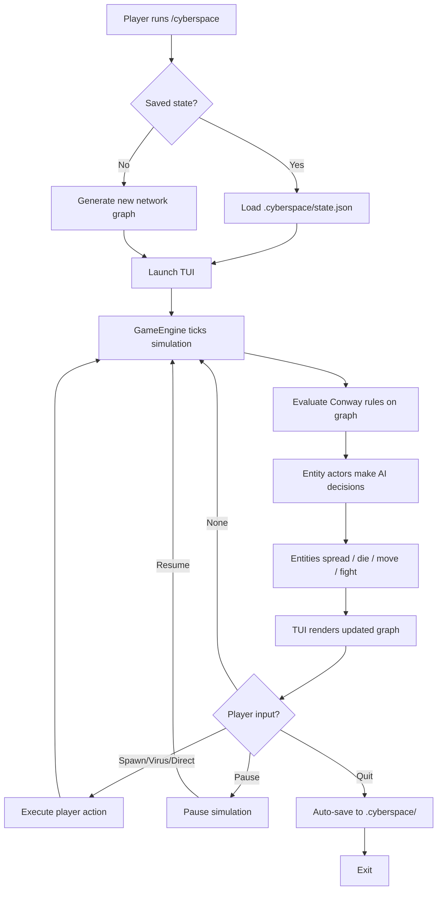

# CYBERSPACE -- Cyberpunk Graph Automaton

## Concept

Conway's Game of Life reimagined on a **network graph** in cyberpunk cyberspace. Instead of a 2D grid with alive/dead cells, you have a DAG of interconnected nodes where AI-driven entities -- programs, ICE, viruses -- spread, fight, evolve, and die according to graph-adapted Conway rules. Each entity is a go-actorlib actor with autonomous behavior.

**The twist**: Cursor agents ARE game entities. Each agent controls a program swarm with its own persona and strategy. Single-agent MVP plays through the TUI. When Cursor goes multi-agent, each agent becomes a living program swarm in cyberspace -- the game scales from solo play to AI swarm warfare without refactoring.

## Repository

New standalone repo: `github.com/barnowlsnest/cyberspace`

Dependencies:

- `github.com/barnowlsnest/go-actorlib/v3` -- Actor model
- `github.com/barnowlsnest/go-datalib` -- Data structures (DAG, Heap, B-Tree, Fenwick, Serial)
- `charm.land/bubbletea/v2` -- TUI framework
- `charm.land/lipgloss/v2` -- TUI styling

## Conway-like Rules on a Network Graph

For a node N connected to neighbors N1..Nk:

**Programs (neon green):**

- **Survive**: Program on N lives if 2-3 connected nodes also have programs
- **Spread**: Empty node spawns a program if exactly 3 connected nodes have programs
- **Die**: Program dies if < 2 allies (isolation) or > 3 (overcrowding), or ICE neighbors outnumber program neighbors
- **AI twist**: Programs are actors that can also choose to *move* along edges, not just passively evolve

**ICE (red) -- Corporate Security:**

- **Patrol**: ICE spreads toward nodes adjacent to programs (drawn to threats)
- **Suppress**: ICE kills programs on nodes where ICE count > program count
- **Respawn**: Destroyed ICE respawns at Firewall nodes (go-actorlib `Supervisor` with `OneForOne`)
- **Escalation**: ICE spawn rate increases over time

**Viruses (magenta) -- Player weapon:**

- **Corrupt**: Virus on a node converts adjacent ICE to programs (flips allegiance)
- **Spread**: Virus moves to adjacent ICE-occupied nodes
- **Decay**: Virus dies after N ticks (short-lived, powerful)

**Data Nodes (cyan) -- Resources:**

- **Attract**: Programs near data nodes get survival bonus (relax the 2-neighbor minimum)
- **Harvest**: Programs on data nodes generate resources each tick

**Firewalls (yellow) -- Barriers:**

- **Block**: Programs need 2 ticks to pass through (slows spread)
- **Deactivate**: Can be disabled by concentrated program presence (4+ programs adjacent)

**Core (white) -- Win target:**

- Heavily connected to Firewall nodes
- Win condition: sustain 3+ programs on Core for 10 consecutive ticks

## Architecture

### Actors (go-actorlib)

```
GameEngine [GoActor]          -- Master simulation loop, ticks world
  |
  |-- ProgramSwarm [GoActor]  -- Manages all program entities, Conway rules + AI decisions
  |-- ICEController [GoActor] -- Manages ICE entities, supervised for respawn
  |-- VirusManager [GoActor]  -- Manages virus lifecycle (spawn, spread, decay)
  |-- ResourceTracker [GoActor] -- Tracks harvested resources
  |
  |-- Supervisor              -- Watches ICE actors, restarts on death
  |-- ActorSystem             -- Named registry for all actors
  |-- Event Bus               -- Network-wide events (ICE deployed, node captured, etc.)
```

Key go-actorlib features:

- `**GoActor[T]` + `Entity**`: GameEngine, ProgramSwarm, ICEController, VirusManager each wrap their entity state
- `**Become` / `Unbecome**`: Programs switch behaviors (spreading, defending, harvesting, evolving). ICE switches (patrolling, pursuing, suppressing)
- `**Supervisor` (OneForOne)**: ICE respawning -- when ICE is destroyed, supervisor restarts it at a Firewall node
- `**ActorSystem`**: Named registry. `system.Send(sys, ctx, "program-swarm", command)` for inter-actor communication
- `**Ask` pattern**: TUI queries game state: `ask.New(ctx, engineRef, getStateQuery, timeout)`
- **Dead letters**: When a program tries to send to a destroyed ICE, dead letter captures it -- shown in event log as "transmission intercepted"
- **Event bus**: `OnEvent` fires for node captures, entity deaths, threat level changes -- TUI subscribes for updates
- **Lifecycle Hooks**: `AfterStart` triggers spawn animation, `AfterStop` triggers death effect in TUI
- **Middleware (Recovery)**: Prevents panics from crashing the simulation
- **Middleware (Metrics)**: Tracks ticks/second, entities processed, avg tick duration -- shown in HUD

### Data Structures (go-datalib)

- `**DAG`** (pkg/dag): The cyberspace network. Nodes are servers/vaults/relays/firewalls/core. Edges are connections. `ForEachNeighbour` drives Conway rule evaluation. `IsAcyclic()` validates generated networks.
- `**Heap`** (pkg/tree): Priority event scheduler. Events sorted by tick number + priority. O(log n) insert/extract for "who acts next."
- `**B-Tree`** (pkg/tree): Sorted resource inventory. `Range` queries for displaying "top resources." `Insert`/`Search` for resource management.
- `**Fenwick Tree`** (pkg/tree): Cumulative threat levels per network region. `Update(region, delta)` when ICE deployed. `RangeQuery(from, to)` for regional threat assessment.
- `**Serial`** (pkg/serial): Thread-safe unique ID generation for entities and events.
- `**Queue`** (pkg/list): Event queue buffering TUI updates from the simulation.
- `**Stack**` (pkg/list): Player action history for undo support.

### TUI Layout (bubbletea v2 + lipgloss v2)

```
┌──────────────────────────────────────┬──────────────────┐
│  CYBERSPACE          Tick: 142       │  ENTITIES        │
│  Threat: ████░░░░ 47%               │                  │
├──────────────────────────────────────┤  ●● SRV-1 [2P]  │
│                                      │  ●  REL-2 [1P]  │
│    ◆SRV-1 ═══ ◇REL-2 ═══ ◆FWL-3    │  ○  FWL-3 [ICE] │
│      ║          ║            ║       │  ●● DAT-4 [2P]  │
│    ◇DAT-4     ◆SRV-5 ═══ ◇REL-6    │  ●  SRV-5 [1P]  │
│      ║          ║                    │  ○  VLT-7       │
│    ◆VLT-7 ═══ ★CORE ═══ ◆FWL-8     │  ★  CORE [ICE]  │
│                                      │                  │
├──────────────────────────────────────┼──────────────────┤
│  EVENT LOG                           │  RESOURCES       │
│  [142] Program spread to REL-2       │  Data: 245      │
│  [141] ICE deployed at FWL-3         │  Compute: 89    │
│  [140] Virus corrupted ICE at SRV-5  │  Cycles: 34     │
│  [139] Program died at VLT-7 (alone) │                  │
│                                      │  SCORE: 1,847   │
└──────────────────────────────────────┴──────────────────┘
 [S]pawn  [V]irus  [D]irect  [Space]Pause  [Tab]Focus  [Q]uit
```

- Neon green/cyan/magenta/red on dark background
- Nodes pulse when entities spawn/die
- Edges highlight when entities spread along them
- Threat bar changes color as ICE escalates

### Player Controls (TUI hotkeys)

- `[S]` Spawn program -- Place a new program on a selected node (costs resources)
- `[V]` Deploy virus -- Launch a virus at a target node (expensive, short-lived, powerful)
- `[D]` Direct -- Nudge programs toward a target node (influence, not direct control)
- `[Arrow keys]` Select node on the graph
- `[Space]` Pause/Resume simulation
- `[+/-]` Speed up/slow down tick rate
- `[Tab]` Cycle focus between panels
- `[U]` Undo last action
- `[Q]` Quit (auto-saves)

### Cursor Integration (MVP)

- `.cursor/commands/cyberspace.md` -- `/cyberspace` command: builds + launches the TUI game
- `Taskfile.yml` -- `task run` for direct launching
- `CLAUDE.md` -- Project context for AI coding sessions

**State Persistence:**

- `.cyberspace/state.json` -- Full game state (network, entities, resources, tick count)
- `.cyberspace/config.json` -- Player preferences (speed, difficulty)
- Auto-saves on quit, loads on start

### Multi-Agent Architecture (v2 -- not in MVP)

Designed for future implementation when Cursor supports multi-agent:

- **Unified CommandQueue** -- All input (TUI hotkeys, agent files, builtin AI) flows through the same `CommandSource` interface. Agent support requires zero changes to the game engine.
- **File-based agent protocol** -- `.cyberspace/agents/<name>/commands.json` for agent decisions. GameEngine reads all agent queues each tick.
- **Agent personas** -- `.cursor/rules/agent-*.md` files that give Cursor agents identity (Scout, Harvester, Sentinel, ICE Commander).
- **Event-driven decisions** -- Agents called only when relevant events happen, not on every tick. Minimizes token cost.
- **Cost tiers** -- Builtin AI (free) handles routine Conway rules. Agents (token cost) handle strategic decisions only.

## Project Structure

```
cmd/cyberspace/
  main.go                        # Entry point
internal/
  game/
    engine.go                    # GameEngine actor (simulation tick loop)
    config.go                    # Tunable parameters (tick rate, ICE escalation, etc.)
    state.go                     # Global game state
  entity/
    entity.go                    # Base entity interface + common state
    program.go                   # Program entity + Conway rules + AI behaviors
    ice.go                       # ICE entity + patrol/suppress behaviors
    virus.go                     # Virus entity + corrupt/decay behaviors
    kind.go                      # Entity kind enum
  network/
    graph.go                     # Cyberspace network (wraps go-datalib DAG)
    node.go                      # Node types: Server, Vault, Relay, Firewall, Core
    generator.go                 # Procedural network generation
    rules.go                     # Conway-like rule evaluation on graph
  scheduler/
    scheduler.go                 # Priority event scheduler (go-datalib Heap)
    event.go                     # Scheduled event types
  resources/
    tracker.go                   # Resource tracking (go-datalib B-Tree)
    threat.go                    # Threat levels (go-datalib Fenwick Tree)
  tui/
    app.go                       # Bubbletea Model/Update/View
    graph_view.go                # Network graph ASCII renderer
    sidebar.go                   # Entity list panel
    eventlog.go                  # Scrolling event stream
    hud.go                       # Header HUD (tick, threat bar, score)
    styles.go                    # Neon cyberpunk lipgloss styles
    keymap.go                    # Key bindings + help
  persistence/
    save.go                      # Save/load to .cyberspace/ directory
.cursor/
  commands/
    cyberspace.md                # /cyberspace -- build + launch game
Taskfile.yml                     # build, run, test tasks
CLAUDE.md                        # Project context for AI sessions
```

## Game Flow




