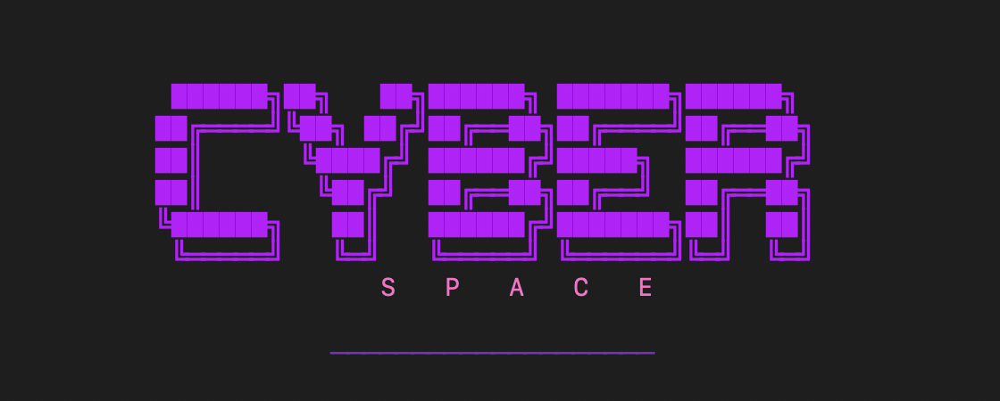
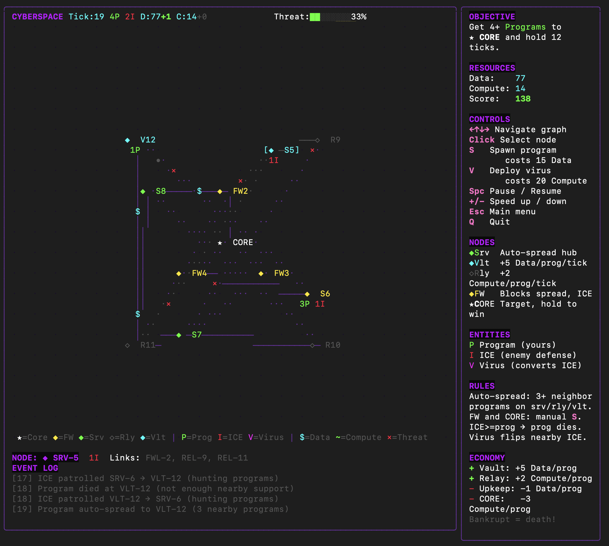

# CYBERSPACE


---------------------------


Terminal network strategy game.

Infiltrate a cyberpunk network, deploy programs, hack through ICE defenses, spread viruses, and capture the CORE to win.

## Run

```bash
task run
```

## How to play

You control **programs** spreading through a network of nodes. Your goal is to get programs to the **CORE** node and hold it.

- Programs auto-spread between servers, relays, and vaults
- **Firewalls** and **CORE** block auto-spread — you must place programs there manually with `S`
- **ICE** (enemy defenses) destroys your programs when it outnumbers them on a node
- **Viruses** convert nearby ICE into programs

### Controls

| Key             | Action                        |
|-----------------|-------------------------------|
| `←`/`↑`/`↓`/`→` | Navigate graph (spatial)      |
| `Click`         | Select node                   |
| `S`             | Spawn program (costs Data)    |
| `V`             | Deploy virus (costs Compute)  |
| `Space`         | Pause / Resume                |
| `+`/`-`         | Speed up / slow down          |
| `Q`             | Quit                          |

### Win condition

Get **4+ programs** onto the **CORE** node and **hold for 8 consecutive ticks**. The CORE doesn't allow auto-spread — you must manually spawn programs there with `S`.

### Lose condition

You lose when **all programs are destroyed** (after a 5-tick grace period at game start). Programs can die in several ways:

- **Starvation** — When Data hits 0, one program starves per tick. Without vault income, your starting 150 Data drains fast.
- **ICE overrun** — When ICE outnumbers your programs on a node, all programs there are destroyed.
- **Overcrowding** — Programs with more than 10 neighbor support die (rare, but possible in dense clusters).
- **Compute drain** — When Compute hits 0, one program is ejected from CORE per tick.

### Economy

- **Data** — earned by programs on Vault nodes (+5/tick). Spent to spawn programs and pay upkeep.
- **Compute** — earned by programs on Relay nodes (+3/tick). Spent to deploy viruses and hold CORE.
- Every program costs 1 Data each tick (upkeep).
- Holding CORE drains 2 Compute per program.
- If Data hits 0, one program starves per tick. If Compute hits 0, one CORE program is ejected per tick.
- Balance expansion vs income to survive!

### Map Symbols

| Symbol | Meaning                                 |
|--------|-----------------------------------------|
| `★`    | Core (target)                           |
| `◆`    | Firewall / Server / Vault (color-coded) |
| `◇`    | Relay                                   |
| `P`    | Program (yours)                         |
| `I`    | ICE (enemy defense)                     |
| `V`    | Virus (converts ICE)                    |
| `$`    | Data flow                               |
| `~`    | Compute flow                            |
| `×`    | ICE threat                              |

## Configuration

All settings are configurable via CLI flags, environment variables, or the in-game Settings menu.

### CLI flags

```bash
go run ./cmd/cyberspace --cyberspace_tick_rate=500ms --cyberspace_initial_programs=5
```

### Environment variables

```bash
CYBERSPACE_TICK_RATE=2s CYBERSPACE_INITIAL_ICE=4 go run ./cmd/cyberspace
```

### All settings

| Flag                                  | Env var                               | Default               | Description                                        |
|---------------------------------------|---------------------------------------|-----------------------|----------------------------------------------------|
| `--cyberspace_tick_rate`              | `CYBERSPACE_TICK_RATE`                | `1s`                  | Game speed (e.g. 500ms, 1s, 2s)                    |
| `--cyberspace_initial_programs`       | `CYBERSPACE_INITIAL_PROGRAMS`         | `5`                   | Starting program count                             |
| `--cyberspace_initial_ice`            | `CYBERSPACE_INITIAL_ICE`              | `3`                   | Starting ICE count                                 |
| `--cyberspace_virus_lifespan`         | `CYBERSPACE_VIRUS_LIFESPAN`           | `8`                   | Ticks before a virus decays                        |
| `--cyberspace_core_win_threshold`     | `CYBERSPACE_CORE_WIN_THRESHOLD`       | `3`                   | Programs needed on CORE to start winning           |
| `--cyberspace_core_win_duration`      | `CYBERSPACE_CORE_WIN_DURATION`        | `8`                   | Consecutive ticks holding CORE to win              |
| `--cyberspace_data_harvest_rate`      | `CYBERSPACE_DATA_HARVEST_RATE`        | `5`                   | Data earned per tick per program on a Vault        |
| `--cyberspace_compute_harvest_rate`   | `CYBERSPACE_COMPUTE_HARVEST_RATE`     | `3`                   | Compute earned per tick per program on a Relay     |
| `--cyberspace_program_spawn_cost`     | `CYBERSPACE_PROGRAM_SPAWN_COST`       | `12`                  | Data cost to spawn a program                       |
| `--cyberspace_virus_deploy_cost`      | `CYBERSPACE_VIRUS_DEPLOY_COST`        | `15`                  | Compute cost to deploy a virus                     |
| `--cyberspace_program_upkeep`         | `CYBERSPACE_PROGRAM_UPKEEP`           | `1`                   | Data cost per program per tick                     |
| `--cyberspace_core_hold_cost`         | `CYBERSPACE_CORE_HOLD_COST`           | `2`                   | Compute cost per program on CORE per tick          |
| `--cyberspace_survive_min`            | `CYBERSPACE_SURVIVE_MIN`              | `1`                   | Min neighbor support for program survival          |
| `--cyberspace_survive_max`            | `CYBERSPACE_SURVIVE_MAX`              | `10`                  | Max neighbor support before overcrowding           |
| `--cyberspace_spread_exact`           | `CYBERSPACE_SPREAD_EXACT`             | `3`                   | Neighbor programs needed for auto-spread           |
| `--cyberspace_initial_data`           | `CYBERSPACE_INITIAL_DATA`             | `150`                 | Starting Data resource                             |
| `--cyberspace_initial_compute`        | `CYBERSPACE_INITIAL_COMPUTE`          | `60`                  | Starting Compute resource                          |
| `--cyberspace_ice_spawn_tick`         | `CYBERSPACE_ICE_SPAWN_TICK`           | `25`                  | Tick when first new ICE spawns                     |
| `--cyberspace_ice_spawn_min_interval` | `CYBERSPACE_ICE_SPAWN_MIN_INTERVAL`   | `8`                   | Fastest ICE spawn interval (tick floor)            |
| `--cyberspace_ice_escalation_tick`    | `CYBERSPACE_ICE_ESCALATION_TICK`      | `80`                  | Tick when ICE bursts begin                         |
| `--cyberspace_ice_escalation_rate`    | `CYBERSPACE_ICE_ESCALATION_RATE`      | `50`                  | Ticks between ICE escalation bursts                |
| `--cyberspace_event_log_size`         | `CYBERSPACE_EVENT_LOG_SIZE`           | `20`                  | Events shown in snapshot                           |
| `--cyberspace_event_log_file`         | `CYBERSPACE_EVENT_LOG_FILE`           | `./cyberspace.log`    | File path for JSON event log (empty = disabled)    |
| `--cyberspace_save_dir`               | `CYBERSPACE_SAVE_DIR`                 | `~/.cyberspace/saves` | Directory for save files                           |

## Test

```bash
task test
```
