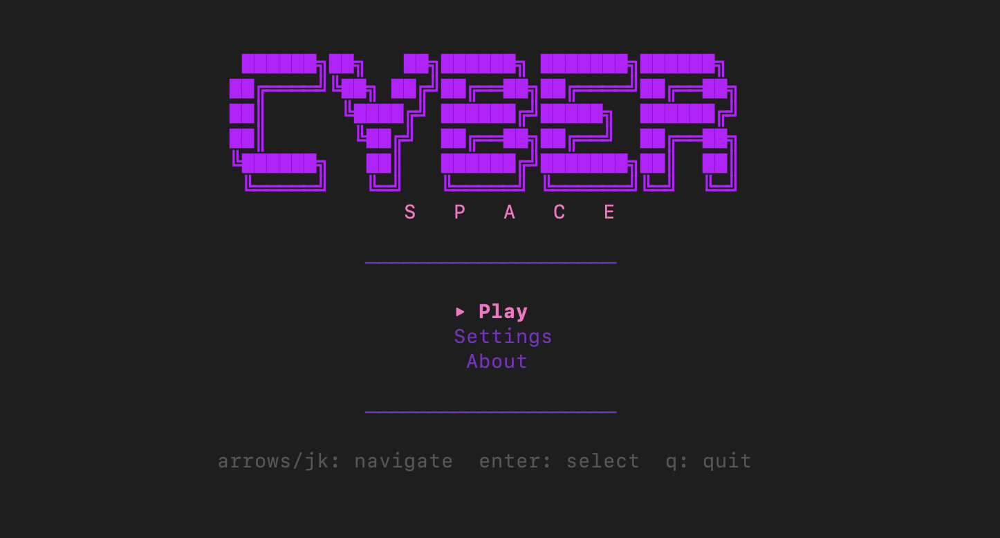

# CYBERSPACE



Terminal network strategy game.

Infiltrate a cyberpunk network, deploy programs, hack through ICE defenses, spread viruses, and capture the CORE to win.

## Run

```bash
task run
# or
go run ./cmd/cyberspace
```

## How to play

You control **programs** spreading through a network of nodes. Your goal is to get programs to the **CORE** node and hold it.

- Programs auto-spread between servers, relays, and vaults
- **Firewalls** and **CORE** block auto-spread — you must place programs there manually with `S`
- **ICE** (enemy defenses) destroys your programs when it outnumbers them on a node
- **Viruses** convert nearby ICE into programs

### Controls

| Key     | Action                         |
|---------|--------------------------------|
| `↑`/`↓` | Select node                    |
| `S`     | Spawn program (costs Data)     |
| `V`     | Deploy virus (costs Compute)   |
| `Space` | Pause / Resume                 |
| `+`/`-` | Speed up / slow down           |
| `Q`     | Quit                           |

### Economy

- **Data** — earned by programs on Vault nodes (+5/tick). Spent to spawn programs and pay upkeep.
- **Compute** — earned by programs on Relay nodes (+2/tick). Spent to deploy viruses and hold CORE.
- Every program costs Data each tick (upkeep).
- Holding CORE drains Compute per program.
- If Data hits 0, programs starve and die. If Compute hits 0, CORE programs fail.
- Balance expansion vs income to survive!

### Map Symbols

| Symbol | Meaning              |
|--------|----------------------|
| `★`    | Core (target)        |
| `◆`    | Firewall / Server / Vault (color-coded) |
| `◇`    | Relay                |
| `P`    | Program (yours)      |
| `I`    | ICE (enemy defense)  |
| `V`    | Virus (converts ICE) |
| `$`    | Data flow            |
| `~`    | Compute flow         |
| `×`    | ICE threat           |

## Configuration

All settings are configurable via CLI flags, environment variables, or the in-game Settings menu.

### CLI flags

```bash
go run ./cmd/cyberspace --cyberspace_tick_rate=500ms --cyberspace_initial_programs=5
```

### Environment variables

```bash
CYBERSPACE_TICK_RATE=2s CYBERSPACE_INITIAL_ICE=4 go run ./cmd/cyberspace
```

### All settings

| Flag | Env var | Default | Description |
|------|---------|---------|-------------|
| `--cyberspace_tick_rate` | `CYBERSPACE_TICK_RATE` | `1s` | Game speed (e.g. 500ms, 1s, 2s) |
| `--cyberspace_initial_programs` | `CYBERSPACE_INITIAL_PROGRAMS` | `3` | Starting program count |
| `--cyberspace_initial_ice` | `CYBERSPACE_INITIAL_ICE` | `3` | Starting ICE count |
| `--cyberspace_virus_lifespan` | `CYBERSPACE_VIRUS_LIFESPAN` | `8` | Ticks before a virus decays |
| `--cyberspace_core_win_threshold` | `CYBERSPACE_CORE_WIN_THRESHOLD` | `4` | Programs needed on CORE to start winning |
| `--cyberspace_core_win_duration` | `CYBERSPACE_CORE_WIN_DURATION` | `20` | Consecutive ticks holding CORE to win |
| `--cyberspace_data_harvest_rate` | `CYBERSPACE_DATA_HARVEST_RATE` | `5` | Data earned per tick per program on a Vault |
| `--cyberspace_program_spawn_cost` | `CYBERSPACE_PROGRAM_SPAWN_COST` | `20` | Data cost to spawn a program |
| `--cyberspace_virus_deploy_cost` | `CYBERSPACE_VIRUS_DEPLOY_COST` | `25` | Compute cost to deploy a virus |
| `--cyberspace_program_upkeep` | `CYBERSPACE_PROGRAM_UPKEEP` | `1` | Data cost per program per tick |
| `--cyberspace_core_hold_cost` | `CYBERSPACE_CORE_HOLD_COST` | `3` | Compute cost per program on CORE per tick |
| `--cyberspace_survive_min` | `CYBERSPACE_SURVIVE_MIN` | `1` | Min neighbor support for program survival |
| `--cyberspace_survive_max` | `CYBERSPACE_SURVIVE_MAX` | `6` | Max neighbor support before overcrowding |
| `--cyberspace_spread_exact` | `CYBERSPACE_SPREAD_EXACT` | `3` | Neighbor programs needed for auto-spread |
| `--cyberspace_initial_data` | `CYBERSPACE_INITIAL_DATA` | `50` | Starting Data resource |
| `--cyberspace_initial_compute` | `CYBERSPACE_INITIAL_COMPUTE` | `25` | Starting Compute resource |
| `--cyberspace_ice_spawn_tick` | `CYBERSPACE_ICE_SPAWN_TICK` | `8` | Tick when first new ICE spawns |
| `--cyberspace_ice_escalation_tick` | `CYBERSPACE_ICE_ESCALATION_TICK` | `25` | Tick when ICE bursts begin |

## Test

```bash
task test
# or
go test ./...
```
